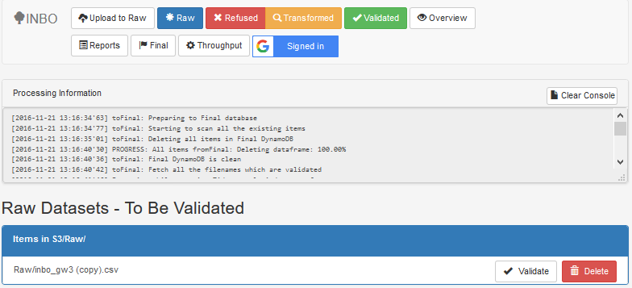

## Step 2 : to_Raw

  

The purpose of the second step is to validate the general data quality of the uploaded file against certain quality criteria and, if approved, transfer the content of the data file into the DynamoDB table "Raw".

  

The tab "Raw" shows the user the source files that have been uploaded to the S3 folder "Raw" and are available to start its structural validation by pressing the "Validate" button. With the structural validation the user has to take into account the following remarks:

- The currently supported file types are : `csv, xls(x), sqlite, shp`
- The filename is validated against a regular expression `\w\.-]+_[\w\.-]+\.[\w\.-]+$` to see if it is compliant with the name convention.
- The data provider is extracted from the filename.
- Based on the data providerID, the corresponding YAML file with the business rules is downloaded from GitHub.
- The YAML file contains the names of the required columns and the minimum % of values.
- The structural validation is done based on the quality criteria in the YAML file
- A Technical Report is generated with the following name convention : `{ProviderID}_{filename}_{Date}_{Time}_TECH.html`

The goal is to perform the initial structural validation based on quality standards that have been defined in the YAML files. This means that the decision is made, _without needing an input of the end-user_.

There are two scenario's in this step, that are shown in the figure below.

  

**Scenario 1** : Dataset is **approved** by structural validation
> - Technical Report is generated and saved in S3 folder "Reports"
- Dataset is written to DynamoDB table "Raw".
- Dataset is exported to csv and saved in S3 folder "RawExports"
- File is moved from S3 folder "Raw" to "Transformed"

**Scenario 2** : Dataset is **refused** by structural validation
>- Technical Report is generated and saved in S3 folder "Reports"
- File is moved from S3 folder "Raw" to "Refused"

If the file is **refused**, the user can review the technical report and assess the situation.
 If the error is _too significant_, the user can delete the file in this folder and contact the provider to remedy the cause, based on the technical report.  If the issue is _minor_, there is an option to move the file back to the S3 folder "Raw" to save time.
 When the user tries to upload a new file, with the same filename as an file in the S3 folder "Refused", the file in the "Refused" folder with automatically be deleted.

In the **APPROVED** scenario, the content of the dataset in DynamoDB table "Raw" is exported to csv.
The overall goal of the proof of value is to facilitate a workflow and result for the end user that is as similar as possible, _whether the analysis is done locally or in the cloud_.
This export ensures that both workflows start with a dataset that is as similar as possible.

The content of the DynamoDB table "Raw" is to be an immutable replica of the raw data from the source files, WITHOUT ANY transformations performed on it.
